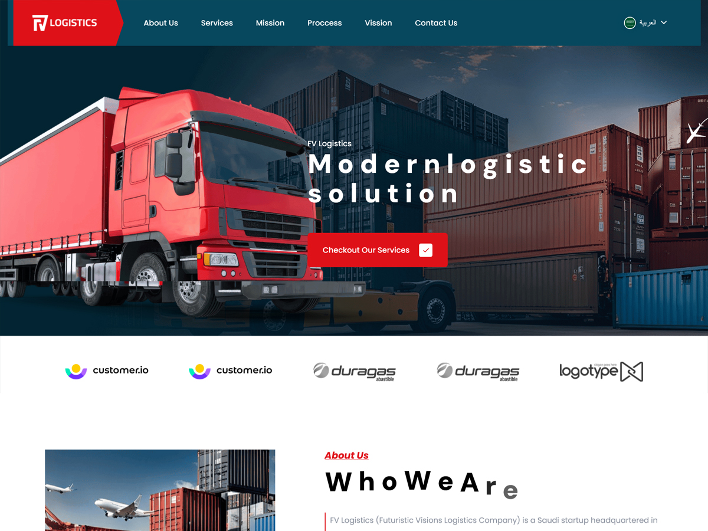

# FV Logistics – Custom WordPress Theme & Elementor Widgets
**كن متقناً**

A fully customized **WordPress website solution** developed for *FV Logistics*, featuring a multilingual corporate design, custom Elementor widgets, and optimized performance across all devices.

---

## 📌 Project Overview

The client requested the development of a professional **single-page corporate website** (with additional sub-pages) supporting both **Arabic and English**, while maintaining the existing layout structure where possible.

To fulfill this, I created a **custom WordPress theme** integrated with **Elementor-based modular widgets**, giving the client full flexibility to edit content, visuals, and structure **without writing any code**.

The project also included:

- Maintaining the integrity of Microsoft email DNS records during domain updates  
- Redirecting the old domains to the new official domain  
- Updating all social media links once provided  
- Delivering a fast, secure, and fully multilingual website

---

## 📄 Pages Included

All core corporate pages were developed using Elementor widgets for complete customizability:

- **Main Page** (full design built with custom Elementor widgets)  
- **About Us** (Elementor widgets)  
- **Contact Us** (Elementor widgets + Contact Form 7 integration)  
- **Services Page** (Elementor widgets)  
- **Privacy Policy** (standard template page)  
- **Terms of Use** (standard template page)

---

## 🧩 Key Features

- Fully custom WordPress theme tailored for FV Logistics  
- Modular Elementor widgets for all major page sections  
- Bilingual structure (Arabic + English) using TranslatePress  
- Clean, organized, and scalable code architecture  
- Responsive design optimized for all screen sizes  
- DNS-safe domain redirection with protection of Microsoft email records  
- Updated social media links as provided by the client  
- Performance-oriented caching and minification  
- Security enhancements through login customization and login hiding  
- Easy future maintenance for non-technical users

---

## ⚙️ Installed & Configured Plugins

To ensure performance, security, and usability, the following plugins were added and configured:

- **Elementor** – Page builder + custom widgets  
- **LiteSpeed Cache** – Optimization, caching, and performance boost  
- **TranslatePress** – Full Arabic/English translation support  
- **Contact Form 7** – Contact form integration  
- **Classic Editor** – Stable editing environment  
- **Login Customizer** – Custom branded login interface  
- **Login Hide** – Additional security layer for wp-admin  

---

## 🚀 Tech Stack

- **WordPress**  
- **PHP**  
- **HTML / CSS / JavaScript**  
- **Elementor Framework**  
- **LiteSpeed Server Optimization**  

---

## 💼 Professional Notes

This project was developed with the principle:  
**"إن الله يحب إذا عمل أحدكم عملاً أن يتقنه"**  
reflecting a commitment to precision, quality, and professional execution at every stage.

---

## 💬 Feedback & Support

If you have questions, need clarifications, or would like to collaborate on similar projects, feel free to reach out.  
Always happy to help.

